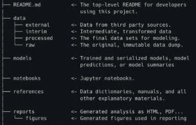

# Evaluación de la Viabilidad del Uso de Imágenes Satelitales en la Estimación de Propiedades del Suelo

## Estructura de trabajo

## Descripción de los notebooks

### Limpieza de datos
1.	**clean_raw_data:** Este notebook limpia los conjuntos de datos de vis-Nir de suelo y vegetación, y el csv con los thresholds por propiedad. La data cruda debe estar en la carpeta “./data/raw” y luego de la limpieza queda en “./data/processed_raw”.
2.	**simulate_satelital_bands:** Este notebook toma la data de vis-Nirs georeferenciada y procesada, es decir que están en “./data/processed_raw”, para crear los conjuntos de datos que simulan las bandas espectrales de Landsat 8, Sentinel-2a y Desis junto con distintos índices espectrales. Finalmente, deja los conjuntos de datos creados en “./data/interim_raw/{satellite}/satellite_{satellite}.csv”.

### Creación de features y entrenamiento de modelos

1.	**sate_preproc_all:** Este notebook toma los conjuntos de datos creados en el notebook anterior y a cada firma espectral le calcula la primera derivada, segunda derivada y continumm removal. Además, los conjuntos de datos generados se generan sin normalizar, normalizados con min-max scaler y normalizados con standard scaler. Finalmente, almacena los conjuntos de datos generados en las carpetas “./data/models/input/”. Cabe resaltar que para cada propiedad tomada en cuenta se crea un conjunto de datos aparte, pues será usado para el entrenamiento.
2.	**sate_models_all:** Este notebook entrena los modelos de regresión lineal, SVR, Lasso, PLSR con dos y seis componentes y Random Forest para cada propiedad con los conjuntos de datos preprocesados que están almacenadado en “./data/models/input/{satellite}/{scaler}/”. Además, almacena los modelos entrenados en “./models/” y los conjuntos de datos tomados para el entrenamiento, validación y predicción junto con las métricas calculadas para cada modelo en “./data/models/prediction/”. Las métricas que se evalúan corresponden a R^2, coeficiente de correlación y MSE para el conjunto de validación y la validación cruzada se realiza sobre todo el conjunto de datos.

### Visualización de resultados
1.	**join_all_results:** Este notebook solo une todos los archivos creados con las métricas, los agrupa por satélite y finalmente los almacena en “./reports/metrics/”.
2.	**visualizing_reults:** Este notebook crea las imagenes de los boxplots creados a partir de las métricas agrupadas por satélites y por modelos. Las imágenes con los boxplots quedan en “./data/reports/figures/”.
Preprocesamiento de imágenes satelitales
1.	**snappy_preprocessing_steps:** Este notebook realiza todo el preprocesamiento de la imagen satelital sentienl2a: corrección atmosférica, resampling, subset y extracción de índices espectrales. Además, extrae la información de las bandas para cada pixel de la data georeferenciada de vis-Nir. (Este notebook se debe ejecutar en Python 2)

### Otros
1.	**visualiza_spectral_data:** Este notebook grafica los espectros para la data de vis-Nir, además, extrae el continum removal de una de sus filas.
2.	**look_for_a_polygone:** Este notebook toma la data vis-Nir y por medio de geopandas y un geojson de Colombia se busca un polígono que contenga todas las muestras.
3.	**analizing_classification_vis_Nirs_{soil/vegetation}_dataset:** Este notebook analiza los espectros de los conjunto de datos de vegetación y suelo junto con un clustering de kmean de las muestras.
4.	**Diferences_between_visNir_and_satellite_data:** Este notebook compara las bandas simuladas de las muestras de visNirs contra las bandas de la imagen satelital de sentinel2a.
